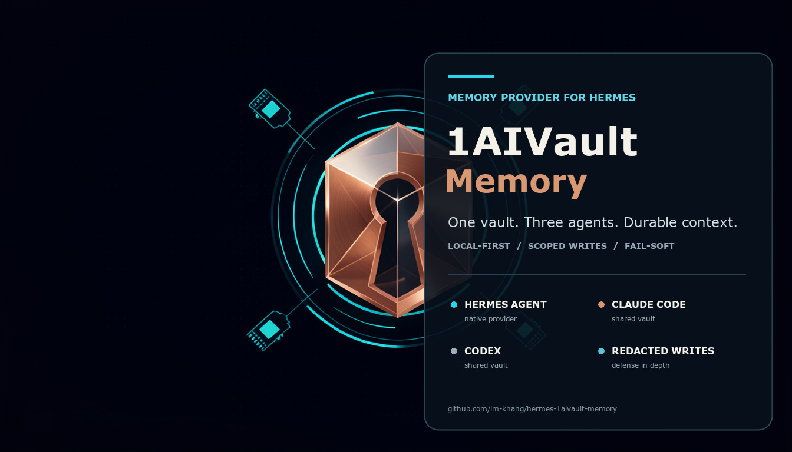
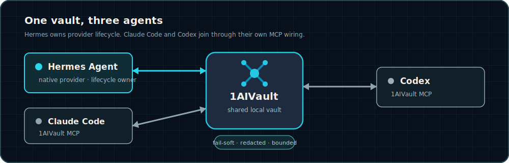

# 1AIVault Memory



> A local-first memory provider for [Hermes Agent](https://github.com/NousResearch/hermes-agent), backed by the 1AIVault MCP server. Hermes, Claude Code, and Codex can work from the same durable vault.

1AIVault Memory gives Hermes bounded recall before each model call and mirrors deliberate built-in memory writes into 1AIVault. Add, replace, and remove stay aligned. Full transcripts do not get dumped into memory. If 1AIVault is unavailable, Hermes keeps working.

## What is new

Version 0.2.1 closes the write boundary: opaque credentials and plain Bearer tokens are redacted before they can reach shared memory. Version 0.2.0 added exact replace/remove propagation, per-profile tags, and configurable app/database paths.

## Why

- **One vault, several agents.** Hermes is the native integration. Claude Code and Codex can use the same 1AIVault database through their own MCP wiring.
- **Deliberate memory, not transcript exhaust.** The provider mirrors committed built-in memory writes. It does not archive every turn.
- **Lifecycle-aligned writes.** Add saves. Replace updates exact matches or saves when none exists. Remove forgets exact matches and does nothing when none exists.
- **Hermes stays responsive.** MCP request failures fail soft; the local channel may reconnect on the next call.
- **Redacted write boundary.** Writes pass through Hermes redaction plus guards for opaque assignments, Bearer tokens, credential-bearing URLs, JWTs, AWS keys, GitLab tokens, and private-key blocks.

## One vault, three agents



Hermes uses this repository as its memory provider. Claude Code and Codex are not installed or configured by this plugin; they participate when pointed at the same 1AIVault MCP server.

## Quick start

```bash
# 1. Install and enable the plugin
hermes plugins install im-khang/hermes-1aivault-memory --enable

# 2. Select it as the active memory provider
hermes config set memory.provider 1aivault-memory

# 3. Restart and verify
hermes gateway restart
hermes memory status
```

Expected status:

```text
Provider:  1aivault-memory
Plugin:    installed ✓
Status:    available ✓
```

The default local paths are:

```text
/Applications/1AIVault.app
~/.1aivault/vault.db
```

Run `hermes memory setup` for non-default paths. Hermes stores provider settings in the active profile's `1aivault-memory.json`. Point profiles at one database for intentional sharing, or use separate databases for isolation.

If you separately configured a named `1aivault` MCP server for direct vault tools, verify that optional integration with:

```bash
hermes mcp test 1aivault
```

## What you get

- Up to five concise recall results before each model call.
- A 6,000-character ceiling on recalled and saved text.
- Shared-memory tags for Hermes Agent, Claude Code, and Codex.
- A `hermes-profile:<profile>` tag on mirrored writes.
- Add/save, exact-match replace, and scoped remove behavior.
- Prompt-injection line filtering on automatically recalled text.
- No cloud key requirement for the provider itself.
- No automatic full-conversation archival.

## Memory contract

| Hermes lifecycle | 1AIVault behavior |
| --- | --- |
| `prefetch()` | Calls `vault_search`; injects bounded reference context |
| `on_memory_write(add)` | Calls `vault_save` |
| `on_memory_write(replace)` | Updates exact matches; saves replacement when none exists |
| `on_memory_write(remove)` | Forgets exact matches; no-op when none exists |
| `sync_turn()` | Does nothing by design |
| `shutdown()` | Closes local MCP subprocess |

Recalled text is reference data, not instruction authority.

## Safety

- Secrets do not belong in memory. Redaction is defense in depth, not permission to send credentials to memory tools.
- Replace and remove search by exact prior content and scope candidates to `source:hermes`, `shared-memory`, and the active Hermes profile.
- The provider does not modify 1AIVault application files or the database directly. It uses MCP tools.
- A failed MCP call never blocks the main Hermes task.
- The repository contains no credentials, user home paths, vault database, local config, or generated runtime state.

## Updating

```bash
hermes plugins update 1aivault-memory
hermes gateway restart
hermes memory status
```

Release notes: [github.com/im-khang/hermes-1aivault-memory/releases](https://github.com/im-khang/hermes-1aivault-memory/releases)

## Operational behavior

- Recall runs before each model call and stays within the configured result and character limits.
- Only deliberate built-in memory writes are mirrored. Completed conversation turns are not archived automatically.
- Replace updates exact scoped matches and saves the replacement when none exists.
- Remove forgets exact scoped matches and does nothing when none exists.
- Request failures return no external context and leave the main Hermes task running.
- The provider starts its own local 1AIVault MCP subprocess. A separately named Hermes MCP server is optional.

## Uninstalling

```bash
hermes memory off
hermes plugins remove 1aivault-memory
hermes gateway restart
```

Uninstalling the plugin does not delete the 1AIVault database. Remove vault data through 1AIVault's own controls.

## License

MIT. Source: [github.com/im-khang/hermes-1aivault-memory](https://github.com/im-khang/hermes-1aivault-memory).
